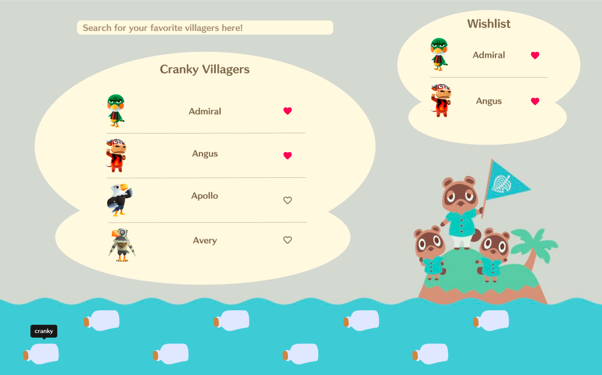

# Animal Crossing Villager Wish List 

Animal Crossing Villager Wish List (pending name) is a full stack 
villager wish list maker built with React, Typescript, Node, and PostgreSQL. 

It is currently a work in progress. 

Users can browse for their favorite villagers and create a wish list for villagers they would love to have in their town. 

## To Do 
- [x] Create database of villagers 
- [x] Create pg dump file of database 
- [ ] Create personality and search routes
- [ ] Add personality routes to front end 
- [ ] Test search functionality 
- [ ] Incorporate acknowledgements/further links section 

## Future Implementations
- Export wish list feature 